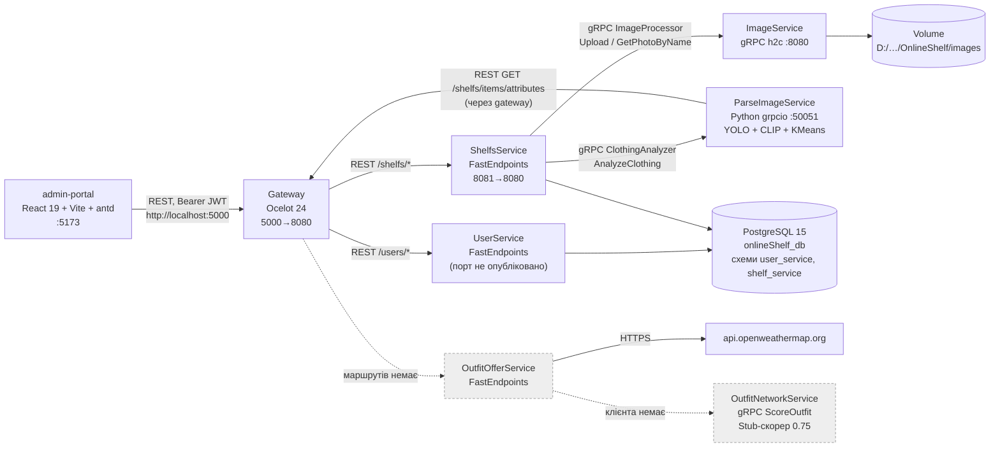

# Звіт №1: дослідження проєкту OnlineShelf (Smart Outfit Recommender)

> Гілка: `offer_service` (останній коміт `063175e`, 2026-09-06). У робочій копії є незакомічені зміни в `ImageService` (Serilog). Я їх не чіпав.
> Нічого не збирав, не запускав і не змінював. Усі висновки зроблено статичним читанням коду. Пункти, які без запуску не перевірити, позначені **[не перевірено запуском]**.
> Секрети (паролі, `SigningKey`, API-ключі) у звіт не переписані.
> ⚠️ Чесна примітка: під час огляду структури я один раз виконав `du -sh` для `ParseImageService/training_sandbox` (~3.6 ГБ). Тобто порахував лише розмір, вміст не читав і не відкривав.

---

## 1. TL;DR

- **Реально працює лише Сценарій А в спрощеному вигляді:** UI → Gateway (Ocelot) → Shelfs (FastEndpoints) → gRPC ImageService (файли на локальному volume, **не S3**). Розпізнавання атрибутів йде окремим запитом Shelfs → gRPC ParseImageService (YOLO + CLIP-zero-shot для матеріалу + KMeans для кольору).
- **Ембедингів немає ніде:** ні в proto ParseImageService, ні в `Item`/`ItemDto`/міграціях Shelfs. Crop Image Service як окремий сервіс відсутній: кроп по bbox YOLO робиться всередині ParseImageService.
- **Сценарій Б не реалізований.** OutfitOfferService вміє лише віддати погоду (OpenWeatherMap, **не Open-Meteo**), кеш 15 хв, без `SemaphoreSlim`. `GenerateOutfit` — порожня заглушка. OutfitNetworkService має хороший каркас скорингу: `IGraphCompatibilityScorer`, `StubGraphCompatibilityScorer` (константа 0.75), `OnnxGraphCompatibilityScorer` (не підключений), штрафи `Π C_j`, gRPC `ScoreOutfit`. Але його ніхто не викликає, а CSP, Beam Search і Gap Analysis відсутні.
- **Словники атрибутів Parse ↔ Shelfs не збігаються** (сезон, патерн, частина матеріалів і типів), тому автодетектування часто повертає `0`. У docker Shelfs працює як `Production`, а довідники атрибутів сидяться лише в `Development`, тож Parse у docker, ймовірно, взагалі не отримає довідників.
- **Серйозні проблеми безпеки:** більшість ендпоінтів `AllowAnonymous` без перевірки власника (IDOR). У `SignIn` немає `return` після невдалої перевірки пароля. JWT-ключ і пароль БД лежать у git. Gateway JWT не валідує.
- **Тестів і CI немає:** `.github/workflows/` порожня, тестових проєктів немає.

---

## 2. Карта архітектури (фактична, з коду)

Суцільні стрілки означають виклики, які є в коді. Пунктир означає, що зв'язок є лише в документі або заготовці.
Crop Image Service, S3/MinIO, черги, SignalR і Worker для VTON у коді відсутні.

---

## 3. Сервіси

### 3.1. Gateway
- **Стек:** ASP.NET Core 8 + Ocelot 24.0.1 (`backend/Microservices/Gateway/Gateway.csproj:14`).
- **Точка входу:** `Gateway/Program.cs:31-82`: CORS для `http://localhost:5173`, `AddOcelot()`, тестові `MapGet("/test/*")` (рядки 54-76). У `/test` є виклик `http://user-service/api/user/test`, такого ендпоінта немає.
- **JWT:** не налаштований. У `Program.cs` немає `AddAuthentication`, в `ocelot.json` немає `AuthenticationOptions`. Токени валідують самі сервіси.
- **Маршрути (`Gateway/ocelot.json`):**
  - `userservice:8080`: `POST /users/add-user`, `GET /users/all`→`/users`, `POST /users`→`/users/getById`, `DELETE /users/{userId}`, `PUT /users/update-user`, `GET /users/get-roles`, `POST /users/sign-in`, `POST /users/verify-user-password`, `POST /users/refresh-token`.
  - `shelfsservice:8080`: `POST /shelfs/item-tags/add`, `DELETE /shelfs/item-tags/remove` (**в Shelfs таких ендпоінтів немає**), `POST /shelfs/items/add-item`, `GET /shelfs/items/attributes`, `GET /shelfs/image/get-image/{imageName}`, `PUT /shelfs/items/update-item`, `GET|DELETE /shelfs/items/{itemId}`, `POST /shelfs/add-shelf`, `POST /shelfs/move-item`, `DELETE /shelfs/{shelfId}`, `PUT|GET /shelfs`, `GET /shelfs/image/recognize{imageName}` (рядок 250: **без `/` перед плейсхолдером**, а в Shelfs маршрут `recognize/{imageName}`).
  - **Маршрутів до OutfitOfferService немає**, хоча `docker-compose.yml:15` має `depends_on: outfitofferservice`.
  - Висячу кому в `ocelot.json:260` конфіг-провайдер .NET, ймовірно, пропускає **[не перевірено запуском]**.
- **Мертвий код:** порожній `Controllers/WeatherForecastController.cs`, `Gateway.http` з `/weatherforecast`, закоментований шаблон у `Program.cs:1-25`.

### 3.2. UserService
- **Стек:** .NET 8, FastEndpoints 7.0.1, FastEndpoints.Security, MediatR, EF Core **9.0.10** + Npgsql 9 (а не EF Core 8, як заявлено), Serilog (`UserService/UserService.csproj`).
- **БД:** схема `user_service`, `DataContext` (`src/UserService.Repository.EfCore/DataContext.cs`). Сутності `User`, `Role`, `UserRoleLink`, refresh-токен зберігається в `User` (`Entities/User.cs:26-27`). Три міграції (`Migrations/`). Рядок підключення береться з `ConnectionStrings:UserDbConnection` (`Extentions/UsersExtention.cs:34`), а `docker-compose.yml:26` задає `ConnectionStrings__ShelfDbConnection`. Змінна не використовується, спрацьовує значення з `appsettings.json` (хост `online-shelf-db`).
- **Ендпоінти** (`src/UserService.Common/ApiRoutes.cs`): `users/add-user`, `users/getById` (POST), `users/{userId}` (DELETE), `users/update-user` (**POST**, `Features/Users/UpdateUser.cs:42`, при тому що gateway проксує лише PUT), `users/get-roles`, `users/sign-in`, `users/refresh-token`, `users/verify-user-password`, `GET users`.
- **JWT:** видача токена в `Features/JwtToken/JwtTokenService.cs` (claim `nameid` + ролі), валідація в `Extentions/JwtAuthorizationExtention.cs`. Політики: Admin/User/PremiumUser/Designer.
- **Профілів, налаштувань і стильових пресетів** (заявлено в звіті) **не знайдено**.
- gRPC відсутній.

### 3.3. ImageService
- **Стек:** .NET 8, `Grpc.AspNetCore` 2.76, SixLabors.ImageSharp. Kestrel працює лише в HTTP/2 на `:8080` (`ImageService/appsettings.json:9-16`).
- **gRPC** (`src/ImageService.Host/Protos/image_processing.proto`), сервіс `ImageProcessor`:
  - `UploadImage(bytes data, file_name) → {big_image_name, small_image_name, success}`: зберігає `{guid}_big.webp` і мініатюру 100×100 `{guid}_small.webp` (`Service/ImageGrpcService.cs:20-56`).
  - `DeleteImage(big, small)` (рядки 58-74). **Файл не захищений від path traversal**: використовується `Path.Combine` без `Path.GetFileName`.
  - `GetPhotoByName(file_name) → stream chunk_data` (чанки по 1 МБ, `Path.GetFileName` є, рядки 173-214).
- **Сховище:** локальна тека `/app/images`, яку `docker-compose.yml:93` монтує з абсолютного Windows-шляху `D:/visualStudio/Projects/OnlineShelf/images`. **S3/MinIO немає.** Метод `GetCrop` із документа **не знайдено**, `RecognizeRawImage`/`RecognizeImageByName` закоментовані (рядки 76-171).
- **Незакомічені зміни:** додано Serilog (`Program.cs:7-19`), але в `appsettings*.json` немає секції `Serilog`, тож `ReadFrom.Configuration` не отримає жодного sink. Схоже, після старту логи нікуди не пишуться **[не перевірено запуском]**.
- Мертвий код: `WeatherForecast.cs`, `Controllers/WeatherForecastController.cs` (але `AddControllers` не викликається), порожня `src/ImageService.Common`, непотрібні пакети FastEndpoints/MediatR/FluentValidation/ErrorOr/Swashbuckle, `GrpcSettings:ParseImageServiceUrl` у `appsettings.json:20-22`.

### 3.4. ShelfsService
- **Стек:** .NET 8, FastEndpoints 8.1, EF Core 9.0.10 + Npgsql, JwtBearer, gRPC-**клієнти** (Grpc.Net.ClientFactory), Serilog (`ShelfsService/ShelfsService.csproj`).
- **БД:** схема `shelf_service` (`src/ShelfsService.Repository.EfCore/ShelfsDataContext.cs:25`). Сутності `Shelf`, `Item`, `AttributeName` (TODO перейменувати на AttributeType), `AttributesValue`. 7 міграцій (`Migrations/`, остання `20260318204242_madeShelfIdUnrequired`, хоча `Item.ShelfId` досі `Guid` non-nullable, `Entities/Item.cs:14`).
- **Модель `Item`** (`Entities/Item.cs`): `Id, Name, UserId, ShelfId, positionKey, BigImage, SmallImage, DateCreated, UpdatedAt, AttributeColorMain (string), AttributeColorSecond (string), AttributeType/Season/Pattern/Matterial (int), isFavorite`. **Поля для ембединга немає.**
- **REST (FastEndpoints)**, `src/ShelfsService.Common/ApiRoutes.cs`:
  - Shelfs: `GET shelfs` (потрібен JWT), `POST shelfs/add-shelf` (JWT), `PUT shelfs` (anon), `DELETE shelfs/{id}` (anon), `POST shelfs/move-item` (anon + ручна перевірка userId).
  - Items: `POST shelfs/items/add-item` (anon + ручна перевірка), `PUT shelfs/items/update-item` (JWT, без перевірки власника), `GET|DELETE shelfs/items/{id}` (anon, без перевірки власника), `GET shelfs/items/attributes` (anon).
  - Images: `GET shelfs/image/get-image/{name}` (проксі-стрім з ImageService), `GET shelfs/image/recognize/{name}` (бере байти з ImageService і шле в Parse, `Features/Images/RecognizeImageByName.cs`).
  - `AddTagsToItem`/`DeleteTagsFromItem` оголошені в `ApiRoutes.cs:22-23`, але ендпоінтів **не знайдено**.
- **gRPC-сервера немає** (у звіті заявлено «REST+gRPC»). Є лише клієнти `ImageProcessor` і `ClothingAnalyzer` (`Extentions/GrpcExtention.cs`). Секції конфігурації названі непослідовно: `GrpcConfigs:ImageServiceUrl` і `GrpcSettings:ParseImageServiceUrl`, дефолт `http://parseimageservice:5000` не збігається з реальним портом 50051 (у docker його перекриває env).
- **Довідники атрибутів:** `AttributeResolver`, singleton-кеш, що наповнюється в конструкторі через `.GetAwaiter().GetResult()` (`Features/Attributes/AttributeResolver.cs:13-44`). Значення сидяться лише в `Development` (`Extentions/DbInitializationExtention.cs:48`), `InsertData` у міграціях немає. `docker-compose.yml:45` і `ShelfsService/Dockerfile:31` виставляють `Production`, тож у docker довідник порожній.
- Seed-значення (`DatabaseSeeder.cs`): Type (25 шт., «Slippers» двічі: рядки 195 і 231), Season (12 шт.: «Early/Midle/Late winter…»), Pattern (8 шт.: «Solid (No Pattern)», «Stripes»…), Material («Cotton», «Polyester», «Wool», «Silk», «Linen», «Denim», «Leather», «Nylon»…).
- Мертвий код: `WeatherForecast.cs`, `Controllers/WeatherForecastController.cs`, закоментований `Program.cs:1-28`.

### 3.5. ParseImageService (Python)
- **Стек:** Python 3.11 (Dockerfile) / 3.12 (`__pycache__`), `grpcio` 1.80, `ultralytics` 8.4.60 (YOLOv8), `transformers` 5.12 (CLIP), `torch` 2.6, `scikit-learn` (KMeans). `requirements.txt` збережено в **UTF-16** і схоже на `pip freeze` цілого середовища (jupyter, esptool, netCDF4, pyresample тощо).
- **Точка входу:** `app/main.py`, gRPC на `[::]:50051` (рядок 24). `Dockerfile:20` робить `EXPOSE 5000`, це розбіжність.
- **gRPC** (`proto/parse-image.proto`, копія в `ShelfsService/src/ShelfsService.Host/Protos/parse-image.proto`), сервіс `clothing.ClothingAnalyzer.AnalyzeClothing(bytes image_data)` → `{success, ClothingAttributes{attribute_color_main, attribute_color_second (string), attribute_type/season/pattern/material (int32), confidence (float)}, error_message}`. **Ембединга в контракті немає.**
- **Пайплайн** (`app/grpc/services/analyzer_service.py`):
  1. Довідники атрибутів тягнуться по REST з `SHELF_SERVICE_URL/shelfs/items/attributes` (`app/core/attributes_client.py:13`, у docker це gateway, `docker-compose.yml:107`).
  2. `ClothingDetector`: YOLO `app/models/weights/fashion_best.pt` (закомічено в git, ~67 МБ), `conf=0.05`, фільтр за назвами типів із БД, кроп по bbox (`clothing_detector.py:21-65`). **Ось де «Crop».** SAM/RemBg і масок немає.
  3. `ColorDetector`: KMeans(3) і грубе мапування у 6 українських назв («Чорний», «Білий», «Червоний»…), `color_detector.py:31-40`.
  4. `MaterialDetector`: zero-shot CLIP `openai/clip-vit-base-patch32` (`local_files_only=True`, кеш HF монтується томом), 8 промптів (`material_detector.py:11-40`).
  5. `PatternDetector`: заглушка, завжди `"plain"` (`pattern_detector.py:15`).
  6. Сезон: `"summer"`, якщо клас у `SUMMER_CLASSES`, інакше `"winter"` (`analyzer_service.py:110`).
- **Невідповідності словників** (через них `get_key_by_value` повертає `0`):
  - сезон `"summer"/"winter"` проти «Early summer» тощо у БД, тож **завжди 0**;
  - патерн `"plain"` проти «Solid (No Pattern)», тож **завжди 0**;
  - матеріал `polyester→"synthetic"` (`material_detector.py:38`), `"corduroy"`; таких значень у БД немає;
  - типи: `classes.json` (Fashionpedia-подібні: «top, t-shirt, sweatshirt», «shoe»…) і коментар про DeepFashion2 (`short_sleeve_top`, `sling`) проти БД («TShirt», «Sneakers»…). Які класи реально має `fashion_best.pt`, з коду не видно.
- **Інше:** на кожен запит пише `debug_yolo_input.webp` у CWD (`analyzer_service.py:68`), логування через `print`, тести відсутні (`tests/Новий Текстовий документ.txt` порожній), `.vscode/launch.json` вказує на неіснуючий `${workspaceFolder}/main.py`.

### 3.6. OutfitOfferService
- **Стек:** .NET 8, FastEndpoints 8.1, EF Core 9.0.10, **але EF Tools 10.0.9** (`OutfitOfferService.csproj:20`). **Провайдера Npgsql немає**, `DbContext` не зареєстрований.
- **Ендпоінти:** `GET offers/get-weather` (`Features/GetWeather/GetCurrentWeather.cs`). **Той самий маршрут** оголошує вкладений клас-заглушка в `Features/GenerateOutfit/GenerateOutfit.cs:16-24`, тож очікується конфлікт маршрутів **[не перевірено запуском]**. Є ще `GET /api/outfit/test` (`Extentions/WebApplicationExtensions.cs:36`).
- **Погода:** OpenWeatherMap `data/2.5/weather` (`Services/GetWeather/OpenWeatherClient.cs:36`), ключ у `appsettings*.json` (закомічений). `WeatherService` округлює координати до 2 знаків (`WeatherService.cs:27-28`), кеш `IDistributedCache` (in-memory) з **TTL 15 хв** (рядок 43). **`SemaphoreSlim` / захисту від thundering herd немає.** У запиті координати оголошені як **поля**, а не властивості (`GetCurrentWeather.cs:8-12`, `longatude`), тож FastEndpoints їх, ймовірно, не прив'яже і завжди прийде (0,0) **[не перевірено запуском]**.
- **Сутності БД** (без контексту й міграцій): `OutfitGenerationRequest` (з `System.Drawing.Color ColorPalette`, EF таке не змапить), `TrainingCollection`, `TrainingItemsSet`. `DataContext` має лише `OutfitGenerationRequests`, `OutfitOfferRepository` повністю закоментований.
- `UseCors("FrontendPolicy")` і `UseAuthentication()` викликаються, хоча `AddCors`/`AddAuthentication` закоментовані або відсутні (`WebApplicationExtensions.cs:16,29`).
- **Клієнтів до Shelfs і OutfitNetwork немає.** CSP, Beam Search, Gap Analysis і черг немає.
- `docker-compose.yml:56`: `Host=localhost` у рядку підключення (у контейнері це вказує сам на себе).

### 3.7. OutfitNetworkService
- **Стек:** .NET 8, `Grpc.AspNetCore`, `Microsoft.ML.OnnxRuntime` 1.29, FastEndpoints (пакет є, але не зареєстрований), Serilog.
- **gRPC** (`src/OutfitNetworkService.Host/Protos/offer-network.proto`): `ScoreOutfit(ScoreOutfitGrpcRequest{repeated ItemNode}) → {final_score, graph_level_score, penalty_multiplier, map applied_penalties, repeated PairwiseScore}` реалізовано в `Grpc/OutfitNetworkGrpcService.cs`. `GenerateOutfits` є в proto (контекст: погода, Occasion, Season), але не реалізований. `ItemNode` уже має `repeated float feature_vector`, `is_virtual`, `is_pinned`.
- Старіша копія proto в `OutfitNetworkService/Host/Protos/offer-network.proto` має інші типи (string замість int32) і не компілюється, бо в `.csproj:21` підключено лише `src/...`.
- **Скоринг** (`Services/ScoringOrchestrator/ScoringOrchestrator.cs`): повний орієнтований граф (`Repository.EfCore/Entities/OutfitGraph.cs:25-41`) → `IGraphCompatibilityScorer` → `IMultiplicativePenaltyCalculator` (`Π C_j` з раннім виходом при 0) → `FinalScore = GraphLevel × Π C_j`.
  - Зареєстровано `StubGraphCompatibilityScorer` (константа 0.75, `Extentions/OutfitNetworkServiceExtentions.cs:16`). `OnnxGraphCompatibilityScorer` закоментований (рядок 18), `Models/outfit_gnn.onnx` відсутній.
  - Контракт ONNX: `node_features[N,F]`, `edge_index[2,E]` → `graph_score`, `edge_scores` (`OnnxGraphCompatibilityScorer.cs:13-17`). **Входу з типами вузлів (категоріями) немає**, а він потрібен для Type-Aware / CSA-Net.
  - Штрафи: зареєстрований лише `ColorClashPenaltyRule` (очікує hex, а `ClashingColorPairs` порожній), `VirtualItemPenaltyRule` написаний, але не зареєстрований.
- REST `ScoreOutfitEndpoint` (`POST /outfit-offer/score`) **ніколи не буде змаплений**: у `Program.cs` немає `AddFastEndpoints`/`UseFastEndpoints`.
- `Program.cs:43`: `UseHttpsRedirection()`. Kestrel не налаштований на HTTP/2-only, тож gRPC по h2c у docker, ймовірно, не працюватиме **[не перевірено запуском]**. `docker-compose.yml:62` задає образ з назвою `outfit-offer-service` (копі-паст), порт не опубліковано, `Host=localhost` (рядок 67), хоча БД сервіс не використовує.
- Тека `Repository.EfCore` містить доменні класи (`ItemNode`, `OutfitGraph`), EF там немає.

### 3.8. frontend/admin-portal
- **Стек:** React 19, Vite 7, TypeScript 5.8, antd 5, TanStack Query 5, axios, dnd-kit, react-color (`package.json`).
- **Сторінки** (`src/App.tsx`): `/`, `/login`, `/register`, `/settings`, `/user-management(/edit/:id)`, `/create-item`, `/item-edit/:id`, `/shelfs`. **Сторінок генерації образу, Wizard (Context/Include/Exclude/Reference) і погоди немає.**
- **API** (`src/api/*`), базовий URL `http://localhost:5000` (gateway), `src/api/httpClient.ts:7`. Access і refresh-токени лежать у `localStorage`, є інтерцептор оновлення токена з чергою.
  - Users: `/users/all`, `POST /users`, `POST /users/update-user` (**gateway має лише PUT**, тож 404), `DELETE /users/{id}`, `/users/sign-in`, `/users/refresh-token`, `/users/get-roles`.
  - Shelfs/Items: усі маршрути з 3.4, `recognize` викликається як `/shelfs/image/recognize/${name}`.
- `CreateItem` надсилає `isFavorite`, а бекенд чекає `IsFavoriteString` (`CreateItem.cs:25,130`). Імовірно, прапорець «улюблене» при створенні втрачається. Тип `ClothingAttributes.attributeMaterial` не збігається з `attributeMatterial` в інших DTO.
- Є `src/api/!localHttpClient.ts` (альтернативний клієнт на `https://localhost:44300`) і файл `MainArea.tsx_checkpoint`.

### 3.9. CI (`.github/workflows`)
- Тека існує, але **порожня**. CI відсутній.

### 3.10. docker-compose: порти та конфігурація

| Сервіс | Host:Container | Примітки |
|---|---|---|
| gateway | 5000:8080 | `Development` |
| userservice | не опубліковано | env `ShelfDbConnection` ігнорується |
| shelfsservice | 8081:8080 | `Production`, тож немає seed атрибутів |
| imageservice | 8080:8080 | volume з абсолютного Windows-шляху |
| parseimageservice | 50051:50051 | Dockerfile `EXPOSE 5000`, кеш HF з `~/.cache/huggingface` |
| outfitofferservice | не опубліковано | `Host=localhost` у БД |
| outfitnetworkservice | не опубліковано | image-name як у offer, `Host=localhost` |
| onlineshelfdb | 5432:5432 | postgres:15, облікові дані в compose у відкритому вигляді |

`docker-compose.override.yml` повністю закоментований. Профіль VS (`backend/Microservices/launchSettings.json`) дебажить лише 4 сервіси.

---

## 4. Заявлено ↔ реалізовано

### 4.1. Сервіси та інфраструктура

| Пункт | Статус | Де в коді | Коментар |
|---|---|---|---|
| Gateway (Ocelot) | 🟡 | `Gateway/Program.cs`, `Gateway/ocelot.json` | Маршрутизація є, JWT на gateway немає, маршрутів до OutfitOffer немає |
| JWT | 🟡 | `UserService/.../JwtTokenService.cs`, `ShelfsService/Extentions/JwtAuthorizationExtension.cs` | Видача й валідація в сервісах. Більшість ендпоінтів `AllowAnonymous` |
| User Service | 🟡 | `UserService/` | CRUD, ролі, sign-in, refresh є. Профілів, налаштувань і стильових пресетів немає |
| Image Service | 🟡 | `ImageService/src/ImageService.Host/` | Upload, GetPhotoByName, Delete є. GetCrop немає, S3 немає |
| Crop Image Service | ❌ | (кроп у `ParseImageService/app/models/clothing_detector/clothing_detector.py:57-58`) | Окремого сервісу немає. YOLO-bbox-кроп усередині Parse. SAM/RemBg/маски не знайдено |
| Parse Image Service | 🟡 | `ParseImageService/app/` | Тип, колір, матеріал є (якість обмежена), патерн — заглушка. **Ембедингу немає** |
| Shelfs Service | 🟡 | `ShelfsService/` | REST CRUD є. **gRPC-сервера немає**, поля для ембединга немає |
| Outfit Offer Service | ❌/🟡 | `OutfitOfferService/` | Лише погода. Генерація — заглушка |
| Outfit Offer Network | 🟡 | `OutfitNetworkService/` | Каркас скорингу та gRPC є. GNN — stub, CSP, Gap Analysis і VTON-задач немає |
| PostgreSQL + EF Core Code-First | ✅ | міграції в `UserService/Migrations`, `ShelfsService/Migrations` | EF Core **9**, а не 8. OutfitOffer без контексту й міграцій |
| S3/MinIO | ❌ | — | Локальний volume |
| gRPC усередині | 🟡 | 3 proto (image, parse, network) | Shelfs→Image і Shelfs→Parse працюють. Offer→Network і Offer→Shelfs відсутні |
| React UI | 🟡 | `frontend/admin-portal` | Гардероб, користувачі. Генерації образу немає |
| CI | ❌ | `.github/workflows/` (порожньо) | — |
| Тести | ❌ | — | Жодного тестового проєкту |

### 4.2. Сценарій А (оцифрування речі)

| Крок | Статус | Де в коді | Коментар |
|---|---|---|---|
| UI → Gateway → Shelfs (multipart) | ✅ | `itemsApi.ts:createItem`, `ocelot.json:141`, `CreateItem.cs` | `AllowAnonymous` + ручна перевірка userId |
| Shelfs → gRPC Image (Upload) | ✅ | `CreateItem.cs:79-92` → `ImageGrpcService.UploadImage` | Реальна назва RPC: `ImageProcessor.UploadImage` |
| Image → Crop | ❌ | — | Кроп не під час завантаження, а в Parse і лише на запит розпізнавання |
| → S3 | ❌ | `ImageGrpcService.cs:35,43` | Локальний диск |
| → Parse (метадані) | 🟡 | `RecognizeImageByName.cs` → `ClothingAnalyzer.AnalyzeClothing` | Окремий виклик із UI (`/shelfs/image/recognize/{name}`), не частина створення айтема. Shelfs тягне байти з Image (`GetPhotoByName`) і шле в Parse |
| → Parse (ембединг `x_i`) | ❌ | — | Немає в proto і в коді |
| Parse → Shelfs → PostgreSQL | 🟡 | `UpdateItem.cs`, `ItemForm.tsx:35,106` | Атрибути повертаються в UI, користувач зберігає форму. Автоматичного збереження немає |
| → UI | ✅ | `ItemForm.tsx` | — |

### 4.3. Сценарій Б (генерація образу)

| Крок | Статус | Де в коді | Коментар |
|---|---|---|---|
| `POST /api/outfits/offer` | ❌ | — | Є лише `GET offers/get-weather`. У gateway маршрутів немає |
| Погода з кешу | 🟡 | `OutfitOfferService/.../WeatherService.cs` | OpenWeatherMap, TTL 15 хв (заявлено 30–60), округлення 2 знаки, **без SemaphoreSlim** |
| Гардероб з ембедингами зі Shelfs | ❌ | — | Немає ні gRPC Shelfs, ні ембедингів |
| CSP-фільтр (прохід 1, `C_j`) | ❌ | — | Лише пост-фактум мультиплікативні штрафи в Network |
| GNN / Beam Search | 🟡/❌ | `OutfitNetworkService/.../ScoringOrchestrator.cs`, `StubGraphCompatibilityScorer.cs` | Скорер-заглушка. Генерації кандидатів і Beam Search немає |
| Скор `S = (Σ w·x)·Π C_j` | 🟡 | `ScoringOrchestrator.cs:35` | `GraphLevel × Π C_j` реалізовано структурно |
| Gap Analysis (`IsVirtual`) | 🟡 | `ItemNode.cs:14`, `PenaltyRules.cs:69-79` | Поле й правило є (правило не зареєстроване). Самого аналізу немає |
| Відповідь 200–300 мс | ❌ | — | Не вимірювалось, ланцюга немає |
| VTON через Queue/Worker | ❌ | — | — |
| SignalR/Polling | ❌ | — | — |

### 4.4. FR / NFR

| Вимога | Статус | Коментар |
|---|---|---|
| FR-1 Гардероб | ✅ | Полиці, речі, drag&drop переміщення |
| FR-2 Автодетектування | 🟡 | Працює, але сезон і патерн завжди 0, частина матеріалів і типів не мапиться |
| FR-3 UI Wizard (Context/Include/Exclude/Reference) | ❌ | Лише DTO `OutfitGenerationRequestDto` (Include/Exclude/Reference) без UI і ендпоінта |
| FR-4 Генерація образу | ❌ | — |
| FR-5 Поради «докупити» | ❌ | — |
| NFR-1 ≤ 500 мс без VTON | ❌ | Немає що вимірювати |
| NFR-2 Координати лише в пам'яті | 🟡 | Координати не зберігаються, але вони в ключі кешу. Для `IDistributedCache` in-memory це прийнятно, з Redis уже ні |
| NFR-3 Горизонтальне масштабування | 🟡 | Сервіси stateless, окрім ImageService (локальний диск) і in-memory кешу погоди |

### 4.5. Інноваційні фічі

| Фіча | Статус | Коментар |
|---|---|---|
| Weather Feedback Loop | ❌ | Лише отримання поточної погоди |
| Multi-Location Closet Tracking | ❌ | Полиці є, статусів доступності речей немає |
| Wishlist Cohabitation + VTON | ❌ | — |
| Асинхронна візуалізація | ❌ | — |
| (заділ) TrainingCollection / TrainingItemsSet | 🟡 | `OutfitOfferService/.../Entities/Training*.cs`: сутності для власного датасету, без контексту |

### 4.6. Окремі перевірки
- **Crop Image Service:** як окремий сервіс не існує. Логіка кропу (bbox YOLO) є в `ParseImageService/app/models/clothing_detector/clothing_detector.py:57-58` і використовується лише всередині аналізу, результат ніде не зберігається.
- **gRPC-виклики сценарію А насправді:** `ImageProcessor.UploadImage`, `ImageProcessor.GetPhotoByName`, `ImageProcessor.DeleteImage` (не викликається: у `UpdateItem.cs:78` стоїть `TODO`), `clothing.ClothingAnalyzer.AnalyzeClothing`. Виклику Image → Parse немає (закоментовано в `ImageService/Program.cs:27-32`).
- **Модель айтема ↔ `WardrobeItemDto`:** `ItemDto` (`ShelfsService/src/ShelfsService.Common/DTOs/Items/ItemDto.cs`) збігається з `WardrobeItemDto` поле в поле (включно з помилкою `AttributeMatterial` та `isFavorite` з малої літери) і додатково має `DateCreated`/`UpdatedAt`. **Поля для ембединга немає** ні в DTO, ні в `Item`, ні в міграціях.
- **Погода / кеш / SemaphoreSlim / JWT / S3:** погода є (OpenWeatherMap), кеш є (in-memory, 15 хв), SemaphoreSlim немає, JWT частково, S3/MinIO немає.

---

## 5. Готовність до GNN-скорера

### 5.1. Що повертає ParseImageService зараз
- Лише дискретні атрибути та `confidence` (`proto/parse-image.proto:23-33`). Ембединга немає.
- Моделі: YOLO `fashion_best.pt` (детекція та кроп), `openai/clip-vit-base-patch32` (лише zero-shot для матеріалу), KMeans (колір). **Плюс:** CLIP уже завантажений у пам'ять (`material_detector.py:11`), тож візуальний ембединг `get_image_features()` можна отримати майже безкоштовно, додавши один виклик. FashionCLIP (як у теорії) не підключено.
- `classes.json` (29 класів, Fashionpedia-подібні), схоже, стосується іншої моделі або тренувального набору. Зв'язок із `fashion_best.pt` з коду не видно.

### 5.2. Що вже є під скорер
- `IGraphCompatibilityScorer` (`OutfitNetworkService/src/OutfitNetworkService.Common/Interfaces/IGraphCompatibilityScorer.cs`) фактично і є `IOutfitScorer` з теорії. Окремого інтерфейсу `IOutfitScorer` **не знайдено**.
- Stub (0.75), ONNX-реалізація (не підключена), `OutfitGraph` (повний граф), `IPenaltyRule` + `MultiplicativePenaltyCalculator` (`Π C_j`), `ScoringOrchestrator`, gRPC `ScoreOutfit` з `feature_vector`.
- CSP-фільтра, генерації кандидатів і Beam Search **немає**. Мапінгу 25 типів у слоти `top/bottom/shoes/outerwear` **теж немає**, а без нього модель `O = ⟨top, bottom, shoes, outerwear?⟩` не побудувати.

### 5.3. Шлях ембединга та контракти, які доведеться змінити

Пропонований шлях: **Parse → Shelfs → (gRPC) → OutfitOffer → (gRPC) → OutfitNetwork**. ImageService у цьому ланцюгу зайвий: він лише зберігає файли, а Shelfs уже вміє брати з нього байти.

| Де | Зміна |
|---|---|
| `ParseImageService/proto/parse-image.proto` **і** копія `ShelfsService/src/ShelfsService.Host/Protos/parse-image.proto` | Додати `repeated float embedding` + `string embedding_model` у відповідь (або окремий `rpc EmbedClothing`, щоб не ганяти YOLO/KMeans заради ембединга) |
| `ParseImageService/app/grpc/services/analyzer_service.py`, `material_detector.py` | Повертати `clip.get_image_features(crop)` (L2-нормований). Згодом замінити на FashionCLIP |
| `ShelfsService/.../Entities/Item.cs` + нова міграція | `float[] VisualEmbedding` (Npgsql мапить у `real[]`) + `string? EmbeddingModel`. Згодом `pgvector` (`Pgvector.EntityFrameworkCore`, `vector(d)`) |
| `ShelfsService/.../Features/Items/CreateItem.cs`, `UpdateItem.cs` | Після `UploadImage` рахувати ембединг на сервері й зберігати (зараз розпізнавання викликається лише з UI). Плюс backfill для наявних речей |
| Новий `shelfs.proto` (gRPC-сервер у Shelfs) | `GetWardrobe(user_id, filters) → repeated WardrobeItem{…attributes, embedding}` |
| `OutfitOfferService` | gRPC-клієнти до Shelfs і Network, ендпоінт генерації |
| `OutfitNetworkService/.../Protos/offer-network.proto` | `feature_vector` уже є. Додати `embedding_model` (перевірка сумісності версій) і, можливо, слот/категорію |
| `OnnxGraphCompatibilityScorer.cs` | Додати вхід `node_types int64[N]` (або категоріальні id атрибутів) для Type-Aware attention |

**Важливий дизайн-момент:** у теорії `x_i` означає конкатенацію категоріальної та візуальної частин, пораховану в Parse. Але атрибути користувач редагує вручну (`UpdateItem`), тож «запечений» `x_i` застарів би. Пропоную **в Shelfs зберігати лише візуальний ембединг** (залежить тільки від фото). Категоріальні embedding-таблиці та проєкцію в спільний простір варто зробити **частиною самої моделі-скорера** (дешеві lookup-и на кожен запит). Тоді редагування атрибутів не потребує перерахунку, а версію моделі легко контролювати через `EmbeddingModel`.

### 5.4. Де запускати GNN

| Варіант | За | Проти |
|---|---|---|
| **A. ONNX у .NET (OutfitNetworkService)** | Каркас уже є (`OnnxGraphCompatibilityScorer`, OnnxRuntime 1.29 у `.csproj`). In-process, без мережевого хопу на кожного кандидата, що критично для Beam Search (сотні оцінок) і NFR-1 ≤ 500 мс. Один артефакт `.onnx` і простий деплой | Експорт PyTorch Geometric у ONNX буває складним (scatter/`MessagePassing`, динамічні форми). Налагоджувати розбіжності Python↔ONNX важче |
| **B. Окремий Python gRPC-сервіс** | Той самий стек, що й тренування (PyG нативно), швидкі ітерації для експериментів | Ще один контейнер з torch (~ГБ). Мережевий виклик на кожен батч, GIL. Потрібен батчинг, щоб вкластися в 500 мс |
| **C. Скорер усередині ParseImageService** | Модель і CLIP в одному процесі | Змішує дві відповідальності (розпізнавання під час оцифрування і скоринг у real-time), різні профілі навантаження |

**Рекомендація: A (ONNX у .NET) як основний шлях, B як інструмент для експериментів за тим самим `IGraphCompatibilityScorer`.**
Аргументи:
1. Графи крихітні (N ≤ 4–6 вузлів, повний граф). NGNN і CSA-Net можна написати в **dense-формі** (матриця суміжності замість `edge_index` + scatter), і тоді ONNX-експорт стає тривіальним (matmul/softmax/gather).
2. Візуальні ембединги рахуються один раз у Python (Parse), тож у real-time-шляху Python не потрібен узагалі.
3. Інтерфейс уже дозволяє підмінити реалізацію. Python-варіант можна підключити як `GrpcGraphCompatibilityScorer` для A/B-порівняння, не чіпаючи оркестратор.

---

## 6. Ризики та технічний борг

1. **Автентифікація та IDOR.** `SignIn.cs:72-76`: після `UnauthorizedAsync` немає `return`, тож код іде далі до видачі токена та запису refresh-токена (відповідь, ймовірно, впаде з помилкою «response already started», але refresh-токен у БД вже збережено). `RefreshToken.cs:52-65` має ту саму проблему плюс NRE при `user == null`. `SignIn.cs:89` логує access-токен (Debug). У Shelfs `DeleteItem`, `GetItemById`, `UpdateShelf`, `DeleteShelf` мають `AllowAnonymous` без перевірки власника, `UpdateItem` перевіряє JWT, але не власника. У UserService `GetAllUsers`, `DeleteUser`, `UpdateUser`, `CreateUser` мають `AllowAnonymous` (`Features/Users/*.cs`).
2. **Секрети в git.** JWT `SigningKey` у `UserService/appsettings.json` і `ShelfsService/appsettings.json`, ключ OpenWeatherMap у `OutfitOfferService/appsettings*.json`, пароль БД у `docker-compose.yml` та `appsettings*.json`. Ключі потрібно ротувати і перенести в `.env` / user-secrets.
3. **Розбіжність словників Parse ↔ БД** (сезон, патерн, матеріали, типи, формат кольору: українські назви vs hex у `ColorClashPenaltyRule`) робить FR-2 та майбутні `C_j` фактично неробочими (див. 3.5).
4. **docker vs код:** Shelfs у `Production` без seed атрибутів, отже Parse не отримає довідників. `Host=localhost` для Offer/Network (`docker-compose.yml:56,67`). Однакова назва образу для offer/network (`:62`). Parse `EXPOSE 5000` проти 50051. Дефолт `:5000` для Parse у `GrpcExtention.cs:23`. Абсолютний Windows-шлях volume (`:93`). OutfitNetwork gRPC без HTTP/2-конфігурації.
5. **Невідповідність маршрутів:** `PUT` у gateway проти `POST` у UserService і фронті для `update-user`. `recognize{imageName}` без `/` в `ocelot.json:250`. Маршрути `item-tags/*` без ендпоінтів. Дубль `GET offers/get-weather` (`GenerateOutfit.cs:21`). REST-ендпоінт Network не реєструється.
6. **Баги:** NRE у `MoveItem.cs:45` (звернення до `item.ShelfId` до перевірки `item == null` на рядку 50). `SeedUserRoleLinks` виходить, якщо ролі вже є (`UserService/.../DatabaseSeeder.cs:59`), тобто на свіжій БД роль Admin, ймовірно, не прив'язується **[не перевірено запуском]**. `DeleteImage` без захисту від path traversal. `AttributeResolver` робить sync-over-async у конструкторі singleton. Прив'язка координат погоди через поля. `System.Drawing.Color` в EF-сутності.
7. **Назви та копі-паст:** `AttributeMatterial`, `Extentions`, `Infrastucture`, `longatude`, `useRecogniozeExistingImage`, `IsProccessed`, `Midle winter`. Клас `DeleteUser` у файлах видалення item і shelf. Логи «Starting ShelfsService» в UserService (`Program.cs:10,30`) і `Application=ShelfsService` у Network (`Program.cs:27`). Namespace `ShelfsService.src.UserService...` у `CreateShelf.cs:14`. Дві різні копії `offer-network.proto`.
8. **Мертвий код і сміття:** `WeatherForecast*.cs` (Gateway, ImageService, ShelfsService, UserService), `backend/Microservices/1.txt` (UTF-16 лог помилки MSBuild про циклічну залежність `GetEFProjectMetadata`), закоментовані шаблони в `Program.cs`, `!localHttpClient.ts`, `MainArea.tsx_checkpoint`, `debug_yolo_input.webp` (пишеться на кожен запит), закомічені `__pycache__/*.pyc`, `ImageService` з непотрібними пакетами.
9. **Залежності:** EF Core 9 (заявлено 8), `EF.Tools 10.0.9` поряд із EF 9 в OutfitOffer, різні версії FastEndpoints (7.0.1 у User, 8.1 деінде). `requirements.txt` в UTF-16 і схожий на повний `pip freeze` (jupyter, esptool…), що роздуває образ. Ваги YOLO (~90 МБ) лежать у git без LFS.
10. **Відсутність тестів і CI.** Немає жодного тестового проєкту, `.github/workflows` порожня. `Claude outputs/settings.json` з правилами `deny` для `training_sandbox` лежить **не** в `.claude/`, тому, ймовірно, неактивний (шляхи `./Microservices/...` схожі на відносні до `backend/`).

---

## 7. Запропонований план наступних кроків (за пріоритетом)

| # | Крок | Складн. | Файли |
|---|---|---|---|
| 1 | **Закрити критичні баги безпеки:** `return` у SignIn/RefreshToken, перевірка власника в Shelfs, прибрати `AllowAnonymous` з мутуючих ендпоінтів, не логувати токени | S | `UserService/src/UserService.Host/Features/Authorization/SignIn.cs`, `RefreshToken.cs`, `Features/Users/*.cs`, `ShelfsService/src/ShelfsService.Host/Features/Items/{DeleteItem,GetItemById,UpdateItem,MoveItem}.cs`, `Features/Shelfs/{UpdateShelf,DeleteShelf}.cs`, `ImageService/.../ImageGrpcService.cs` |
| 2 | **Секрети поза git + ротація ключів** (`.env` для compose, user-secrets локально) | S | `docker-compose.yml`, `*/appsettings*.json`, `.gitignore` |
| 3 | **Привести до ладу docker/маршрути:** `Host=onlineshelfdb`, імена образів, h2c для Network, `EXPOSE 50051`, seed атрибутів через `HasData`/міграцію (щоб працювало в Production), `PUT`/`POST` update-user, `recognize/{imageName}`, прибрати `item-tags`, маршрути `/offers/*` у gateway | S–M | `docker-compose.yml`, `Gateway/ocelot.json`, `ShelfsService/.../ShelfsDataContext.cs` + міграція, `ParseImageService/Dockerfile`, `OutfitNetworkService/appsettings.json`, `Program.cs`, `UserService/.../UpdateUser.cs` |
| 4 | **Уніфікувати словники атрибутів** (Type/Season/Pattern/Material/Color). Один канонічний перелік і явний мапінг класів YOLO на Type. Формат кольору (hex + назва) | M | `ShelfsService/.../DatabaseSeeder.cs` (+міграція), `ParseImageService/app/grpc/services/analyzer_service.py`, `material_detector.py`, `pattern_detector.py`, `color_detector.py`, `classes.json` |
| 5 | **Візуальний ембединг у Parse:** reuse CLIP `get_image_features` (згодом FashionCLIP), поле `embedding` + `embedding_model` у proto | M | `ParseImageService/proto/parse-image.proto`, `ShelfsService/src/ShelfsService.Host/Protos/parse-image.proto`, `ParseImageService/app/...`, `app/grpc/generated/*` |
| 6 | **Зберігання ембединга в Shelfs:** `Item.VisualEmbedding real[]` + `EmbeddingModel`, міграція, обчислення в Create/Update, backfill | M | `ShelfsService/.../Entities/Item.cs`, `Migrations/*`, `Features/Items/CreateItem.cs`, `UpdateItem.cs`, `Helpers/ImageAnalyzer.cs` |
| 7 | **gRPC-сервер Shelfs `GetWardrobe`** + мапінг типів у слоти (top/bottom/shoes/outerwear/accessory) | M | новий `ShelfsService/.../Protos/shelfs.proto`, `ShelfsService.csproj`, `Program.cs`, `ShelfsService.Common` (довідник слотів) |
| 8 | **OutfitNetwork: довести каркас.** Зареєструвати `VirtualItemPenaltyRule`, вхід `node_types` в ONNX-контракті, конфіг Kestrel h2c, юніт-тести `ScoringOrchestrator`/`MultiplicativePenaltyCalculator`/`OutfitGraph` | S–M | `OutfitNetworkService/Extentions/OutfitNetworkServiceExtentions.cs`, `.../OnnxGraphCompatibilityScorer.cs`, `appsettings.json`, новий `OutfitNetworkService.Tests` |
| 9 | **OutfitOffer: генерація.** Ендпоінт `POST offers/generate`, CSP-фільтр (погода, сезон, Include/Exclude), генерація кандидатів і Beam Search, виклик Network `ScoreOutfit`, `SemaphoreSlim` + TTL 30–60 хв для погоди, виправлення прив'язки координат і дубля маршруту | L | `OutfitOfferService/src/**`, `Extentions/InfrastructureExtention.cs`, `.csproj` (gRPC-клієнти), `offer-network.proto` (копія-клієнт) |
| 10 | **Навчання та експорт моделі:** Polyvore → dense-NGNN/CSA-Net → ONNX, перевірка паритету Python↔ONNX, fine-tune на власних `TrainingCollection`. Паралельно — мінімальний CI (build + test) | L | `ParseImageService/training_sandbox/` (я не переглядав), `OutfitNetworkService/Models/outfit_gnn.onnx`, `.github/workflows/ci.yml` |

---

## 8. Відкриті питання до тебе

1. **Погода:** у звіті заявлено Open-Meteo, у коді OpenWeatherMap (з ключем). Який провайдер фінальний? Open-Meteo не потребує ключа.
2. **Crop Image Service:** чи планується окремий сервіс із SAM/RemBg, чи для магістерської достатньо YOLO-bbox-кропу всередині Parse? Чи зберігати кроп / фото без фону в ImageService?
3. **S3/MinIO:** чи потрібно реально переходити, чи для захисту достатньо локального volume з абстракцією `IImageStorage`?
4. **Склад `x_i`:** чи згоден зберігати в Shelfs лише візуальний ембединг, а категоріальну частину рахувати в моделі (див. 5.3)? Яка розмірність `d` цільова (64 з теорії, CLIP дає 512)?
5. **Слоти образу:** хто і як мапить 25 типів у `top/bottom/shoes/outerwear`? Як трактувати `Dress` (top+bottom) та аксесуари (Hat, Belt, Watch)?
6. **`fashion_best.pt`:** на якому датасеті навчено і які в неї класи? `classes.json` схожий на Fashionpedia, коментар в `analyzer_service.py` — на DeepFashion2. Що вже є в `training_sandbox` (я туди не заходив)?
7. **Колір:** канонічний формат hex, назва палітри чи обидва? Фронт використовує `react-color`, Parse повертає українські назви.
8. **БД OutfitOffer:** окрема схема в `onlineShelf_db` чи окрема БД? Для чого `TrainingCollection` (збір дизайнерських образів для fine-tune)?
9. **OutfitNetwork REST vs gRPC:** чи потрібен REST-ендпоінт `/outfit-offer/score` (для дебагу), чи лишаємо тільки gRPC?
10. **Профілі та стильові пресети в UserService:** це ще в планах чи можна прибрати з опису архітектури?
11. **`Claude outputs/settings.json`:** це мало бути `backend/.claude/settings.json` (або кореневий `.claude/`)? Зараз `deny`-правила, схоже, не діють.
12. **Незакомічені зміни в ImageService (Serilog):** це робота в процесі? Додати секцію `Serilog` в `appsettings.json`?
